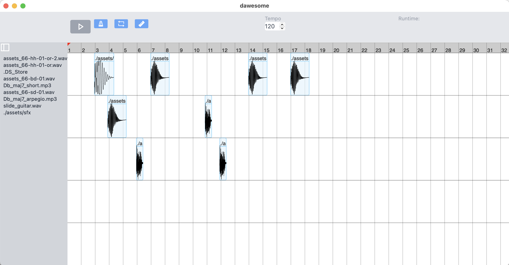
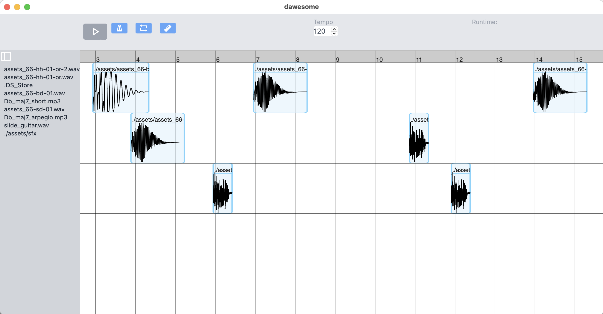

# 🎹 Dawsome

An awesome, libre, and cross-platform DAW 
(and extremely early work in progress) 
built with Rust, Tauri, React, and Typescript.




_Early screenshots of Dawesome running on Mac_
<!-- _An early screenshot of Dawesome running on Xubuntu_ -->

<br />

## About

<!-- ### Backend? Frontend? Oh my... -->

<!-- ### Why just why -->

### Project design

On compilation, Tauri generates bindings for
Rust functions to be called by the _frontend_, or
the Typescript code that ultimate gets rendered by [Wry](https://github.com/tauri-apps/wry).
Rust commands are called from the frontend by Tauri's `invoke` method.
See [the docs](https://tauri.studio/docs/guides/command/#passing-arguments) 
on this for more information.

#### Redux

Redux slices are a neat and concise way of issuing
commands to the Rust/Tauri _backend_, or the meat 'n bones
of the Dawesome. The backend includes every moving part Daweome has
under the hood. Redux and Redux slices are the 
metaphorical bolts used to unite Dawesome's internal components
with the much prettier exterior.

Below is a brief example of how Redux slices work
for toggling Dawesome's playlist:
_Note that 'playlist' here, is synonymous with 'arrangement view' in Ableton-speak._

```ts
// src/state/slices/playlistSlice.ts 

import { createSlice, Dispatch } from '@reduxjs/toolkit'
import { invoke } from '@tauri-apps/api'
import { RootState } from 'state/store'

export interface PlaylistState {
  playing: boolean
}

const initialState = {
  playing: false,
} as PlaylistState

export const playlistSlice = createSlice({
  name: 'playlistSlice',
  initialState,
  reducers: {
    setPlaying: (state, action) => {
      state.playing = action.payload
    },
  },
})

// start play/pause methods
export const { setPlaying } = playlistSlice.actions

// a React component calls this Thunk to toggle the playlist
export const togglePlay = () => async (dispatch: Dispatch) => {
  await invoke<void>('toggle_playlist', {})
  const playing = await invoke<boolean>('get_playlist_playing', {})
  dispatch(setPlaying(playing))
}

export const selectPlaylistPlaying = (state: RootState) =>
  state.playlist.playing

// ...

// export root reducer for this slice
export default playlistSlice.reducer
```

A component calling this Thunk (which invokes the Rust function, then sets the state (the root state 
is defined by the 
[InnerState struct](https://github.com/nbennett320/dawesome/blob/main/backend/src/daw/state/state.rs)))
might look like this:


```tsx
// src/components/topbar/PlayPauseButton.tsx

import React from 'react'
import {
  togglePlay,
  selectPlaylistPlaying,
} from '../../state/slices/playlistSlice'
import Button from '../common/Button'
import { useAppSelector, useAppDispatch } from '../../hooks/redux'
import PlayIcon from '../icons/PlayIcon'
import PauseIcon from '../icons/PauseIcon'

const PlayPauseButton = () => {
  // uses the redux selector and thunk dispatcher 
  // hooks to set and get state
  const playing = useAppSelector(selectPlaylistPlaying)
  const dispatch = useAppDispatch()
  
  return (
    <Button
      onClick={() => dispatch(togglePlay()) }
      className="bg-gray-400 hover:bg-gray-500 py-1 px-3 rounded inline-flex items-center"
      aria-label="Play/Pause Button"
    >
      {playing ? <PauseIcon fill="white" /> : <PlayIcon fill="white" />}
    </Button>
  )
}

export default PlayPauseButton
```

#### Sound streams and DSP

Dawesome uses [Rodio](https://docs.rs/rodio/latest/rodio/) for sound file decoding,
as well as handling audio playback and managing available drivers on Mac and Windows devices.
On Linux, [Rust bindings](https://docs.rs/libpulse-binding/latest/libpulse_binding/) 
for [PulseAudio](https://www.freedesktop.org/software/pulseaudio/doxygen/) are used.
As such, functions and modules that use PulseAudio to handle audio steams are prefixed with:
```rs
// conditionally compile for linux
#[cfg(target_os = "linux")]
fn foo() {
  // ...
}
```
and those that use Rodio for handling audio streams are prefixed with:
```rs
// conditionally compile for not-linux
#[cfg(not(target_os = "linux"))]
fn foo() {
  // ...
}
```

## Development environment

The development environment uses [Tauri](https://tauri.studio/) for the backend, and 
[Vite](https://vitejs.dev/) and [pnpm](https://pnpm.io/) for the frontend.

To learn React, see the [React documentation](https://reactjs.org/).

### Available Scripts

In the project directory, you can run the following scripts:

#### `pnpm dev`

This command runs both the backend and frontend.\
Tauri will open a new window with the app in development mode.

The page will reload if you make edits.
You will also see any lint errors in the console.

See the section about [development](https://tauri.studio/docs/api/cli#dev) for more information.

To run the frontend separately from the backend, use `pnpm ui:start`.

#### `pnpm build`

Builds the app for production to the `build` folder.\
This builds the Tauri app bundle and correctly bundles React in production mode, optimizing the build for the best performance.

The build is minified and the filenames include the hashes.\
Your app is ready to be deployed!

See the section about [building](https://tauri.studio/docs/api/cli#build) for more information.

#### `pnpm build:assets:link`

Create a symbolic link for the assets directory in the
project build directory. This is a temporary solution 
for getting compiled binaries working properly.

#### `pnpm ui:test`

Launches the test runner in the interactive watch mode.\
See the [Jest docs](https://jestjs.io/) for more information.

## Resources

### Research, articles, tutorials, and misc. implementation details

- [Steinberg implementation spec](http://jvstwrapper.sourceforge.net/vst20spec.pdf)
- [The nature of sound: lecture/text on audio programming](https://mu.krj.st/)
- [ALSA/PulseAudio driver research with `cpal` (warning: links to google docs)](https://docs.google.com/document/d/10EL1qd6ZPkn6ySAPlXY7oea80nWwPV4X4csI4m4ujuY)
- [ALSA/PulseAudio: playing a wav file example](http://ysflight.in.coocan.jp/programming/audio/pulseAudioSample/e.html)

### Read more about...

- [Tauri](https://tauri.studio)
- [PulseAudio](https://www.freedesktop.org/software/pulseaudio/doxygen/)
- [Wry](https://github.com/tauri-apps/wry)

See `docs/` for more.
